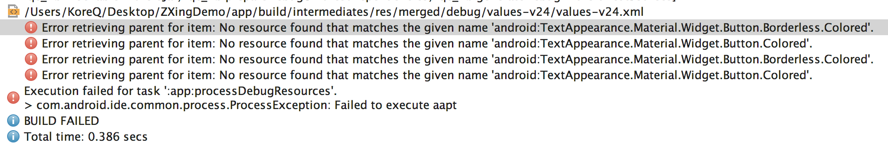

## Android异常整理##
---关键字--- TranscationTooLargeException

### TranscationTooLargeException
##### 问题原因
Binder传输的数据太大 如果Binder的参数或返回值太大，不适合的事务缓冲区，然后调用将失败，并将被抛出TransactionTooLargeException

### No Resource found

##### 问题原因
1、`com.android.support:appcompat-v7`版本问题，library中的版本和application中的版本不一致；并且版本不能高于`targetSdkVersion`

##### 参考链接
&emsp;&emsp;&emsp;&emsp;0、**Android 异常汇总：**http://blog.csdn.net/weihan1314/article/details/8232060
&emsp;&emsp;&emsp;&emsp;1、**Bugly社区：**http://bugly.qq.com/bbs/forum.php?mod=viewthread&tid=865
&emsp;&emsp;&emsp;&emsp;2、http://www.voidcn.com/blog/ballonge/article/p-5765197.html
&emsp;&emsp;&emsp;&emsp;3、**stackoverflow.com：**http://stackoverflow.com/questions/11451393/what-to-do-on-transactiontoolargeexception
&emsp;&emsp;&emsp;&emsp;4、**异常分析：**http://ju.outofmemory.cn/entry/252024