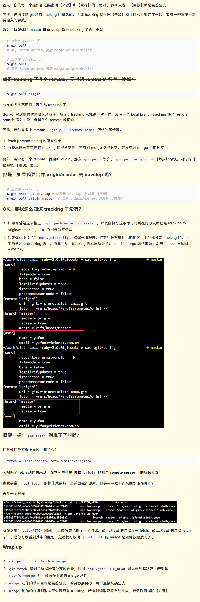

## Git学习教程
---关键字--- git 协作开发

推荐教程 ：`http://www.liaoxuefeng.com/wiki/0013739516305929606dd18361248578c67b8067c8c017b000`

### 协作开发流程
1、项目会有一个生产环境的分支：`master`、一个测试开发的分支：`dev`、若干开发分支；  
2、`master`分支的代码需要保持稳定，用户发布线上代码或正式打包；dev环境的代码用来发布到测试环境或打测试包；开发分支是每个开发者自己独立的分支；  
3、假设当前开发版本为5.0，则可以从master分支上新建一个分支名字为：`dev5.0`；每个开发者需要在dev5.0上新建自己的开发分支，现假设有两个开发者的分支：`dev_tom`、`dev_bob`；  
4、假设`dev_tom`开发完成后，先更新dev5.0分支的代码，然后将`dev_tom`合并到本地`dev5.0`，最后经过代码review可以合并到远程`dev5.0`；  
5、最后当所有开发分支都提交到`dev5.0`后，并且完成测试工作，再将`dev5.0`合并到`master`分支即可。  

### Code Review的流程

### 常用操作
1、在当前分支的HEAD上创建tag：`git tag v1.0`，并提交的远程仓库 ：`git push origin v1.0` 
2、删除远程分支：`git push origin --delete <branchname>`；删除tag：`git push origin --delete tag <tagname>`

### 注意
1、切换分支时，当前分支应该没有修改，若有修改需要`commit`或者`stash`，然后再执行切换。  
2、git pull 和 git fetch的区别(`git pull = git fetch + merge to local`)

2.1、我的试验结论  
&emsp;&emsp;&emsp;&emsp;(1)、`git fetch` 可以将远程库所有分支的更新拉到本地，但是不与本地分支合并；`git pull` 也可以将远程库分支的更新拉到本地，同时只会合并当前的本地分支及其对应(tracking)的远程分支。  
&emsp;&emsp;&emsp;&emsp;(2)、IDEA中的Git管理工具的`git pull`命令是指定了本地分支和远程分支的，所有操作的只是这两个分支，其他分支的更新不会被拉到本地。  
&emsp;&emsp;&emsp;&emsp;(3)、A merge B ： 是将B中的代码合并到A

### 其他配置
1、如何给每个仓库配置单独的`user.name` 和 `user.email`：见参考链接-1

### 参考链接
1、Git 配置 ：`https://cnbin.github.io/blog/2015/05/22/git-pei-zhi/`  
2、使用 Git 协作开发项目指南：`http://blog.qiji.tech/git-flow`  
3、git pull和git fetch的区别 ： `https://ruby-china.org/topics/15729`
