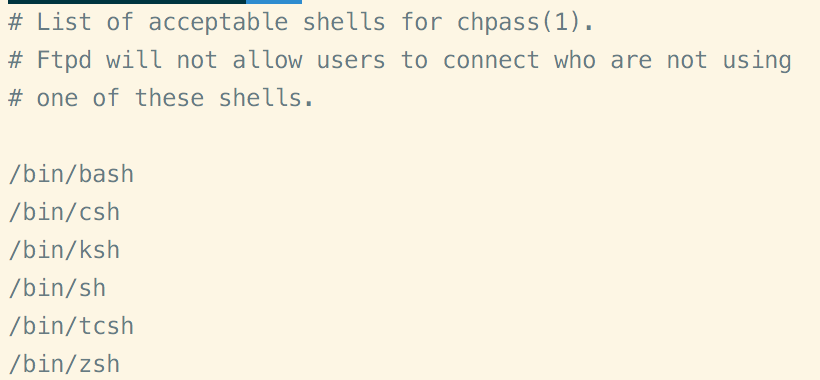
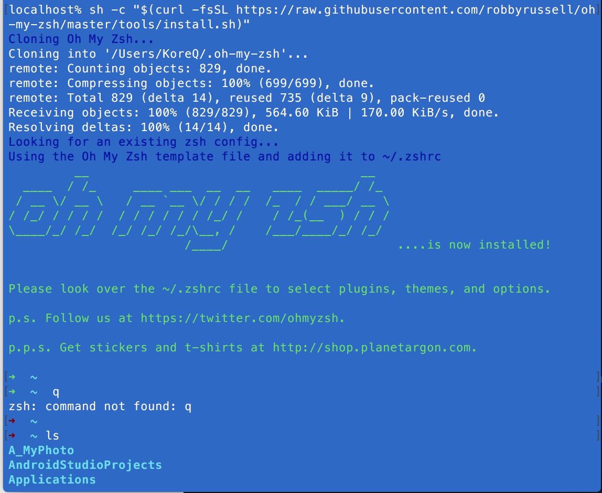
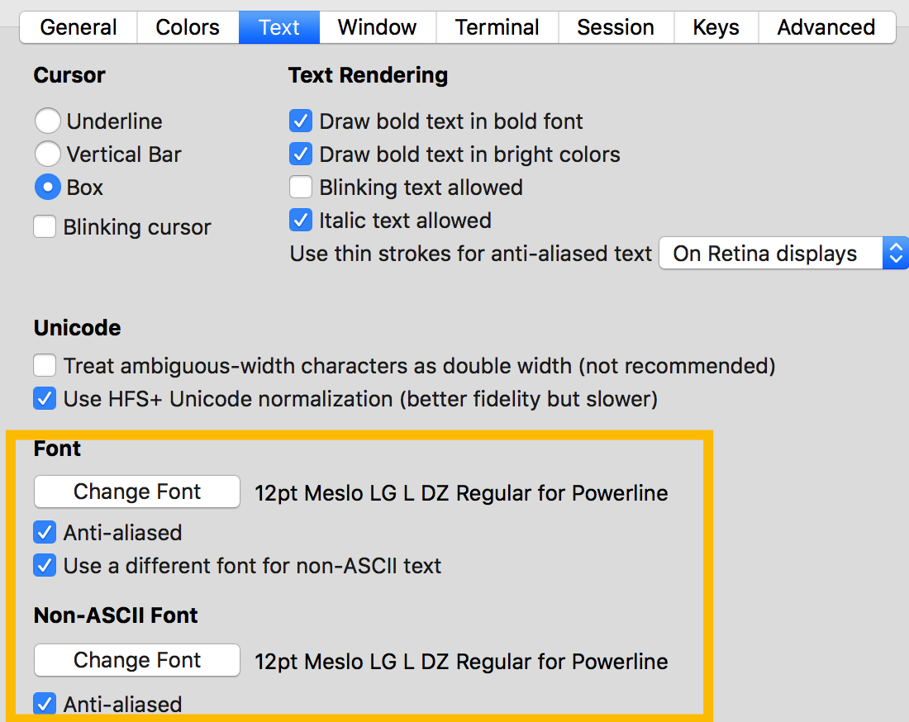

##Mac中Zsh + iTerm2的使用及配色##
---关键字--- iTerm2 Zsh LSCOLORS zsh插件

###环境
&emsp;&emsp;MasOS EI Capitan 10.11

&emsp;&emsp;**Zsh + oh my zsh + iTerm2 + zsh扩展插件**
###给iTerm2配色
#####操作步骤
&emsp;&emsp;1、在~/.bash_profile文件中添加如下内容（该步骤操作完成后系统终端颜色也改变了）

`export CLICOLOR=1`
`export LSCOLORS=gxfxcxdxbxegedabagacad`
`export PS1='\[\033[01;32m\]\u@\h\[\033[00m\]:\[\033[01;36m\]\w\[\033[00m\]\$ '`
`export TERM=xterm-color`

&emsp;&emsp;2、打开终端输入`source ~/.bash_profile`使环境变量生效

&emsp;&emsp;3、打开iTerm2的使用偏好设置，选择profiles，然后选择Colors标签，再点击“Load Preset”按钮选择“Import”添加后缀名为“.itermcolors”的文件，并选择该配置方案即可。

&emsp;&emsp;**4、备注：LSCOLORS的配置规则**

LSCOLORS是用来设置当CLICOLOR被启用后，各种文件类型的颜色。

LSCOLORS的值中每两个字母为一组，分别设置某个文件类型的文字颜色和背景颜色。LSCOLORS中一共11组颜色设置，按照先后顺序，分别对以下的文件类型进行设置：

directory

symbolic link

socket

pipe

executable

block special

character special

executable with setuid bit set

executable with setgid bit set

directory writable to others, with sticky bit

directory writable to others, without sticky bit

LSCOLORS中，字母代表的颜色如下：

a 黑色

b 红色

c 绿色

d 棕色

e 蓝色

f 洋红色

g 青色

h 浅灰色

A 黑色粗体

B 红色粗体

C 绿色粗体

D 棕色粗体

E 蓝色粗体

F 洋红色粗体

G 青色粗体

H 浅灰色粗体

x 系统默认颜色

###使用zsh + oh my zsh实现配色
#####安装zsh
&emsp;&emsp;1、`brew link pcre`

&emsp;&emsp;2、执行命令：`zsh --version`，如果没有zsh，则执行命令：`brew link zsh`

&emsp;&emsp;3、查看系统安装的shell：`cat /etc/shells`
结果如下图：

&emsp;&emsp;4、切换默认shell：`chsh -s /bin/zsh`，执行`echo $SHELL`看到`/bin/zsh`或类似内容即可

&emsp;&emsp;5、安装oh-my-zsh，执行命令：`sh -c "$(curl -fsSL https://raw.githubusercontent.com/robbyrussell/oh-my-zsh/master/tools/install.sh)"`

&emsp;&emsp;6、更换zsh主题，打开~/.zshrc文件，找到“ZSH_THEME”变量，并修改成`ZSH_THEME="agnoster"`(推荐使用agnoster，gianu)，保存后，在终端中执行`source ~/.zshrc`使环境变量立即生效即可

&emsp;&emsp;7、安装字体，为了支持agnoster主题中箭头的显示，执行如下命令：`git clone https://github.com/powerline/fonts.git`
`cd fonts`
`./install.sh`

&emsp;&emsp;8、打开iTerm2的使用偏好设置，选择profiles，然后选择Colors标签，再点击“Load Preset”按钮选择`solarizad dark`或者`solarizad light`，并将`Profiles --> Text --> Draw bold text in bright colors`前面的对勾去掉。我选择的是`Dark Background`，颜色比较好看。

&emsp;&emsp;9、修改iTerm2的字体，按下图修改：

###ZSH的插件
#####autojump
&emsp;&emsp;1、安装`autojump`，执行命令`brew install autojump`

&emsp;&emsp;2、打开~/.zshrc文件，找到 plugins=开头的行，在后面添加autojump：plugins=(git autojump)

&emsp;&emsp;3、在~/.zshrc文件中新添加一行`[[ -s $(brew --prefix)/etc/profile.d/autojump.sh ]] && . $(brew --prefix)/etc/profile.d/autojump.sh`

&emsp;&emsp;4、保存退出，并执行命令`source ~/.zshrc`

#####增加指令高亮效果——zsh-syntax-highlighting
&emsp;&emsp;1、使用git下载插件，为了方便管理，我创建了一个新的目录：`~/Documents/configure`，用来存放插件，执行命令`cd ~/Documents/configure`
`git clone git://github.com/zsh-users/zsh-syntax-highlighting.git`

&emsp;&emsp;2、在~/.zshrc文件中添加：`source ~/Documents/configure/zsh-syntax-highlighting/zsh-syntax-highlighting.zsh`

&emsp;&emsp;3、使修改后的环境变量生效：在命令行执行`source ~/.zshrc`，不报错即可

#####其他插件
&emsp;&emsp;1、Zsh全程指南：http://wdxtub.com/2016/02/18/oh-my-zsh/

&emsp;&emsp;2、**一些命令行效率工具：**http://wulfric.me/2015/08/zsh/

###参考链接

&emsp;&emsp;&emsp;&emsp;1、MacOS终端颜色定制：http://www.jianshu.com/p/620f66cad0a7

&emsp;&emsp;&emsp;&emsp;2、iTerm2 for mac 介绍：https://my.oschina.net/gabriel1215/blog/356935

&emsp;&emsp;&emsp;&emsp;3、**zch教程文档**：https://wiki.archlinux.org/index.php/Zsh_(%E7%AE%80%E4%BD%93%E4%B8%AD%E6%96%87)

&emsp;&emsp;&emsp;&emsp;4、**gitbook - 配置iTerm2**：`https://laoshuterry.gitbooks.io/mac_os_setup_guide/content/4_ZshConfig.html`

&emsp;&emsp;&emsp;&emsp;5、**oh my zsh**：https://github.com/robbyrussell/oh-my-zsh

&emsp;&emsp;&emsp;&emsp;6、**iTerm2-DIY（字体、插件）**：http://www.jianshu.com/p/7de00c73a2bb

&emsp;&emsp;&emsp;&emsp;6、iTerm2 颜色主题：https://github.com/mbadolato/iTerm2-Color-Schemes

&emsp;&emsp;&emsp;&emsp;7、iTerm2使用教程：http://swiftcafe.io/2015/07/25/iterm/

&emsp;&emsp;&emsp;&emsp;8、autojump使用安装：http://www.barretlee.com/blog/2015/03/30/autojump-in-mac/

&emsp;&emsp;&emsp;&emsp;9、iTerm2常用功能（快捷键、搜索） ：http://wulfric.me/2015/08/iterm2/

