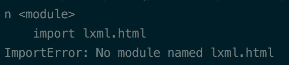

##Python数据分析##
---关键字--- python

###在MAC上搭建python数据分析开发环境
&emsp;&emsp;&emsp;&emsp;**安装教程：**https://segmentfault.com/a/1190000004358667
&emsp;&emsp;&emsp;&emsp;**注意：** 如果安装失败就加上`sudo`，如果再不行就加上`sudo -H`，还得解决SIP的问题。

###安装TuShare
&emsp;&emsp;&emsp;&emsp;1、下载tushare压缩包，地址：`https://pypi.python.org/pypi/tushare/`，解压后并执行命令：`python setup.py install`，如果出现如下错误，则说明缺少依赖包，需要安装依赖：

&emsp;&emsp;&emsp;&emsp;2、安装依赖：`sudo -H pip install lxml`、`sudo -H pip install requests`、`sudo -H pip install pandas`（pandas上文已经安装过）

###常见问题
&emsp;&emsp;&emsp;&emsp;1、描述：在MacOS EI Capitan及以上版本，苹果加入了SIP(SystemIntegrity Protection)机制，在安装过程中会出现如下问题，即使`sudo`也解决不了：
```
OSError: [Errno 1] Operation not permitted: 
'/var/folders/8l/3r1wnr_j0v74s4458hg2yy1h0000gn/T/pip-9xRrCl-uninstall/System/Library/Frameworks/Python.framework/Versions/2.7/Extras/lib/python/numpy-1.8.0rc1-py2.7.egg-info'
```
&emsp;&emsp;&emsp;&emsp;**解决方案**
&emsp;&emsp;&emsp;&emsp;关闭SIP，步骤如下：
&emsp;&emsp;&emsp;&emsp;（1）重启电脑，按住“Command” + R
&emsp;&emsp;&emsp;&emsp;（2）点击电脑上方的“使用工具” --> “终端”
&emsp;&emsp;&emsp;&emsp;（3）输入命令`csrutil disable`，关闭SIP，打开SIP，输入：`csrutil enable`，然后重启电脑即可。
（4）注意：不完全关闭SIP：`csrutil enable --without debug`，可以使用第三方插件，比如XtraFinder。

###参考链接

&emsp;&emsp;&emsp;&emsp;1、富途牛牛vs同花顺app分析：http://www.jianshu.com/p/08ebb47532d6